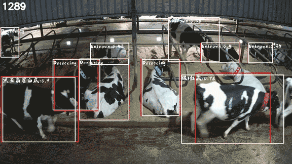

# cow-related-project
this project aims to track all the cow in the cow farm 7/24.

YOLOv3_tensorflow_from_zzb：
牛体、脖带检测训练脚本

bodai_classify: 
脖带分类训练脚本

registration_plus：
牛体注册模型训练脚本
ps: 训练时分两步，第一步用 fc+CrossEntropy， 第二步用svam+xentrophy
直接用svam+xentrophy训练是模型会不收敛loss不降

U2_Net：
显著性牛体分割训练脚本
其中包括一些trick，背景涂成125，旋转角度

cow_model_three：
封装了牛体检测+脖带检测+脖带分类模型的infer
其中还包括了脖带涂黑脚本

videoCut_cowRec_bodaiRec_cowSeg_Regisiter：
包含从视频分帧-》牛体检测-》脖带检测-》图片模糊分类-》牛体显著性分割-》牛体注册
整个infer过程，可以用来对保存的牛体信息进行注册

Cow_track_demo：
采用deepSort，对牛体进行跟踪
视频分帧-》牛体检测-》计算512维特征-》相似度比较-》指派预测追踪框和实际检测框

最后成品如下：  

